<div align="center">

# 🚇 FareMap

### The Commuter Intelligence Platform

**Zero Cost. Zero Latency. Zero Compromise.**


[](https://duckdb.org)
[](https://github.com/fxxii/faremap)
[](https://duckdb.org)
[](LICENSE)

[**Launch App**](https://fxxii.github.io/faremap) 
</div>

---

## 💡 The Problem

Londoners spend over **£2,000 annually** on transport, yet the "cost of convenience" remains invisible. 

- **Citymapper** optimizes for *Time*.
- **Google Maps** optimizes for *Traffic*.
- **NO ONE** optimizes for *Your Wallet*.

Commuters unknowingly pay a "Zone Penalty" every day because they don't see the price cliff just 5 minutes away.

## 🚀 The Solution: "Waze for Your Wallet"

FareMap is the first **Headless Commute Analytics Engine**. It empowers users to visualize the financial landscape of their city instantly.

> "Walk 300m to the next station, save £1.50 per trip. That's £700/year tax-free in your pocket."

### Key Capabilities
- **🔥 Heatmap Intelligence**: See "expensive zones" instantly.
- **⚡ Real-Time Price/Time Tradeoffs**: Compare "Fastest" vs "Cheapest" in milliseconds.
- **🛡️ 100% Privacy**: All calculations happen on *your* device. No tracking.

---

## 💎 The Technical Moat (Tier 0 Architecture)

FareMap is built on a revolutionary **Serverless / Tier 0** stack. This architecture flips the traditional SaaS unit economics on its head.

### 📉 Zero Marginal Cost (Investors Take Note)
Unlike traditional apps that bleed cash as they scale (more users = more DB servers), FareMap's cost is **static**.

- **1 User Cost**: $0 (Static Hosting)
- **1,000,000 Users Cost**: $0 (Static Hosting)

The compute power is decentralized to the *Edge* (the User's Browser). We scale infinitely with **zero infrastructure overhead**.

### 🛠️ 2026 Tech Stack

This project leverages the cutting edge of WebAssembly (WASM) and Columnar Analytics.

| Component | Technology | The "Subtle Flex" |
|-----------|------------|-------------------|
| **Data Warehouse** | **DuckDB-WASM** | A full OLAP SQL database running *inside* Chrome. No network latency after load. |
| **Storage** | **Apache Parquet** | Industrial-grade columnar compression. 600+ stations & 20k fares in <500KB. |
| **Intelligence** | **Client-Side A*** | Pathfinding runs locally. We don't fetch routes; we *think* them. |
| **Visualization** | **MapLibre GL** | GPU-accelerated Vector Tiles. 60fps glassmorphism on any device. |

<br>

<table>
<tr>
<td align="center" width="120">

<br><strong>JavaScript</strong>
<br><sub>ES2024</sub>
</td>
<td align="center" width="120">

<br><strong>DuckDB</strong>
<br><sub>WASM</sub>
</td>
<td align="center" width="120">

<br><strong>MapLibre</strong>
<br><sub>GL JS</sub>
</td>
<td align="center" width="120">

<br><strong>Python</strong>
<br><sub>ETL</sub>
</td>
</tr>
</table>

---

## 🏗️ Architecture: The "Self-Healing" Mesh

Our **Self-Healing ETL Pipeline** ensures data freshness without human intervention.

```mermaid
flowchart LR
    TfL["🚇 TfL Unified API"] -->|Weekly Scrape| ETL["⚙️ Self-Healing ETL"]
    ETL -->|Optimization| Parquet["📦 Parquet Data Mesh"]
    Parquet -->|CDN Edge| Browser["🌐 User Browser (Edge)"]
    Browser -->|WASM| Analytics["🧠 DuckDB Intelligence"]
    Browser -->|WebGL| Map["🗺️ MapLibre Visualization"]
```



1.  **Extract**: Weekly recursive scrape of new pricing structures.
2.  **Transform**: Decouples *Topology* (Maps) from *Logic* (Fares) to minimize payload.
3.  **Load**: Pushes highly compressed Parquet files to the CDN Edge.

---

## 🚀 Quick Start

Want to see the engine in action?

```bash
# Clone the repository
git clone https://github.com/fxxii/faremap.git
cd faremap

# Install dependencies
npm install

# Start development server
npm run dev
```

Open `http://localhost:5173`. Prepare to be amazed by the speed of Local-First Analytics.


## Data Sources

- **TfL Unified API**: Base station and fare data.
- **TubeCreature**: Detailed route geometry courtesy of [Oliver O'Brien](https://github.com/oobrien/vis/blob/master/tubecreature/data/).

---

<div align="center">

**Built for the Smart Commuter.**

[⬆ Back to top](#-faremap)

</div>
